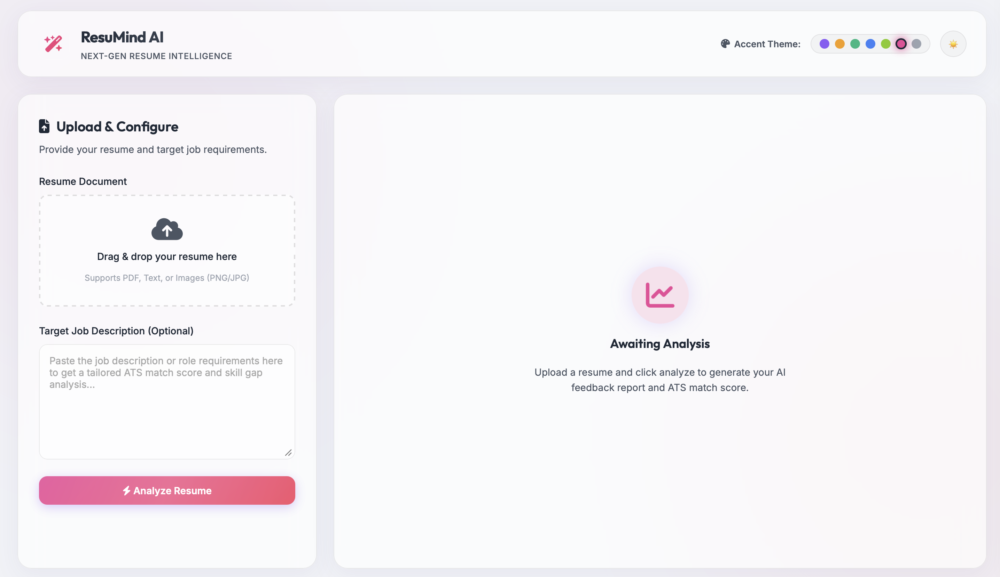
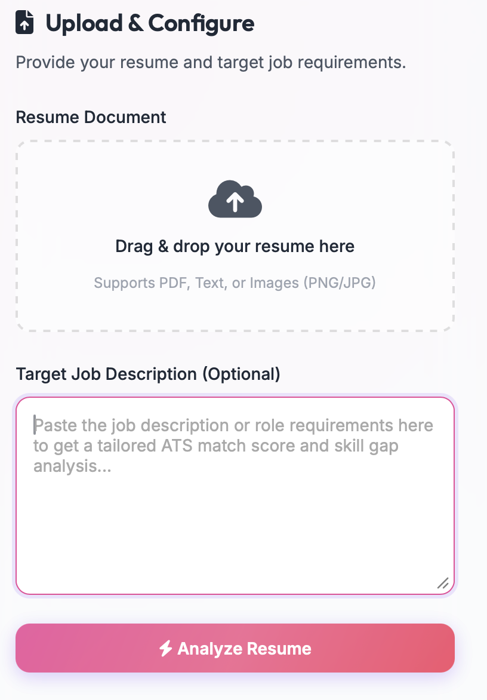
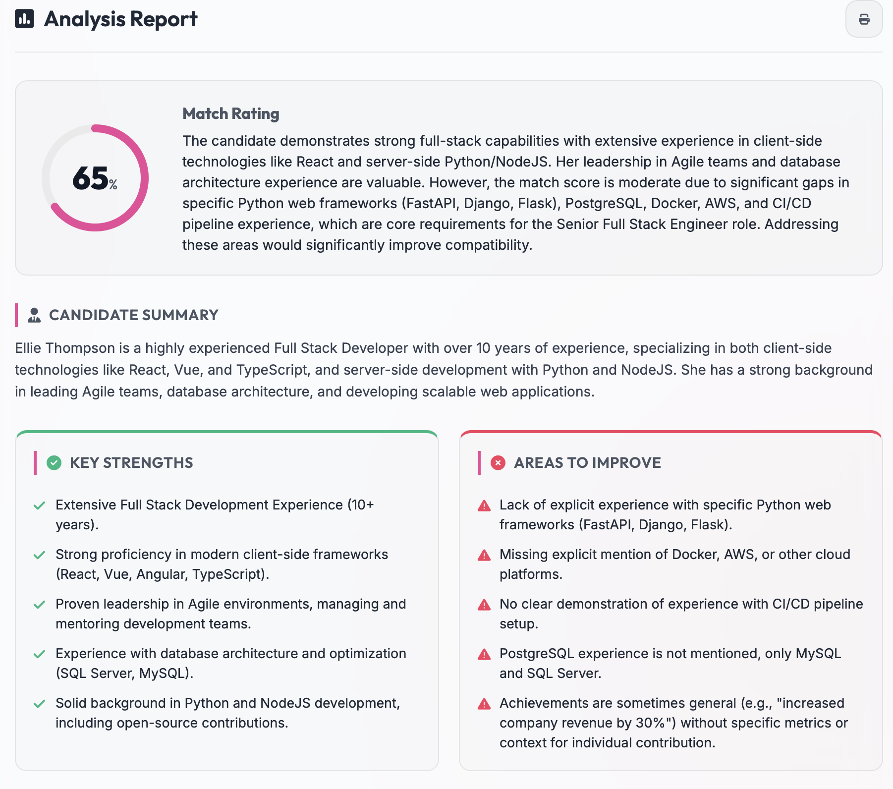
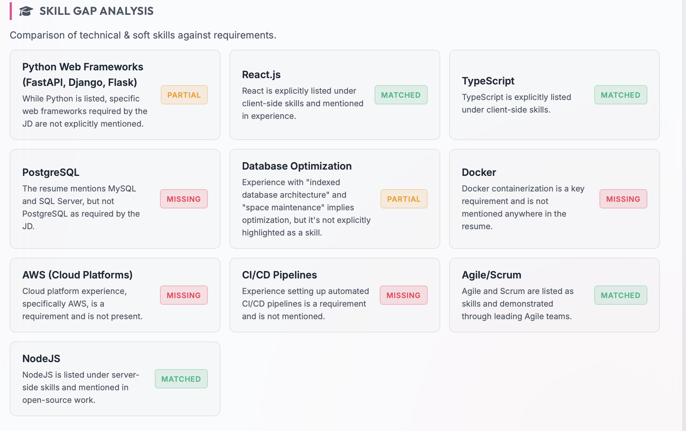
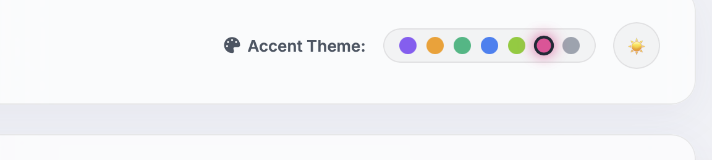

# ResuMind AI — Advanced Resume Analyzer & ATS Optimizer

[](https://resumind-ai-app.netlify.app)
[](https://ai-resume-analyser-yk2g.onrender.com)
[](https://ai.google.dev/)

**ResuMind AI** is an intelligent, full-stack resume analysis application designed to audit resume compatibility against targeted job descriptions. Featuring a highly interactive glassmorphic dashboard interface, the application evaluates resumes across various formats (including document scans and images) to produce structured match scores, skill gap matrices, and ATS keyword optimization insights.

---

## 🔗 Deployed URLs
* **Live Frontend Website (Netlify)**: [https://resumind-ai-app.netlify.app](https://resumind-ai-app.netlify.app)
* **Live API Backend Server (Render)**: [https://ai-resume-analyser-yk2g.onrender.com](https://ai-resume-analyser-yk2g.onrender.com)

---

## 📸 Screenshots

### 1. Home Dashboard Page


### 2. Multi-Format Upload System


### 3. ATS Analysis & Match Score Rating


### 4. Interactive Skill Gap Matrix


### 5. Multi-Accent Theme Swapper & Day/Night Mode


---

## ⚡ Core Features

1. **Multimodal Resume Parsing**: 
   * Supports standard PDF and plain text documents.
   * Leverages Gemini 2.5 Flash's computer vision to process **PNG, JPG, and JPEG screenshots or image scans** of resumes, eliminating the need for complex, heavy local OCR libraries (like Tesseract).
2. **Dynamic Laser Scanner Animation**:
   * Engages the user with a futuristic loading animation representing the parsing and analysis phases.
   * Displays dynamic status indicators (e.g., *"Extracting Content Layout..."*, *"Auditing Skill Sets..."*) with a progress bar before transitioning to the final report.
3. **Structured Pydantic Data Verification**:
   * Enforces strict data output shapes using Pydantic Models in Python. This guarantees that the Gemini API returns structured JSON data containing exact keys (`score`, `strengths`, `weaknesses`, `skill_gap`), securing frontend stability.
4. **Day/Night Theme Toggle**:
   * Toggles between a dark space-themed glassmorphism style and a clean light mode with a single click. Uses native emojis (🌙 for night and ☀️ for day) and persists settings in the browser's `localStorage`.
5. **Interactive Color Accent Swapper**:
   * Features 7 highly distinct, glowing color accent themes (Nebula Violet, Amber Gold, Emerald Mint, Electric Ice, Cyber Lime, Sakura Rose, and Monochrome Platinum) designed to look beautiful in both dark and light modes.
6. **Click-to-Copy ATS Keywords**:
   * Generates key optimization keywords to include in the resume. Clicking a keyword chip copies it instantly to the clipboard with an interactive toast notification.

---

## 📂 Project Directory Structure

```
ai-resume-analyzer/
│
├── backend/
│   ├── main.py            # FastAPI Application Entrypoint (CORS, Endpoint definitions)
│   ├── parser.py          # PDF document text extractor using `pypdf`
│   ├── analyzer.py        # Gemini API integration using the `google-genai` SDK
│   ├── requirements.txt   # Python backend dependencies
│   ├── test_backend.py    # Environment diagnostic and API key test script
│   └── .env.example       # Example environment configuration template
│
├── frontend/
│   ├── index.html         # Main dashboard layout (semantic HTML5, Theme pickers)
│   ├── style.css          # Glassmorphic stylesheet (accent rules, animations, responsive design)
│   └── app.js             # Client-side routing, API connection, dynamic SVG charts
│
├── screenshots/           # Actual application screenshots for documentation
│   ├── home_page.png
│   ├── resume_upload.png
│   ├── ats_analysis.png
│   ├── skill_gap_analysis.png
│   └── theme_switcher.png
│
├── .gitignore             # Git configuration to block venv and secret files
├── README.md              # Project documentation (this file)
├── sample_resume.txt      # Mock resume for quick platform testing
└── sample_job_description.txt # Mock job description for alignment checks
```

---

## 🛠️ Technology Stack

### Frontend (Client-side)
* **Markup & Structure**: HTML5 (Semantic elements)
* **Styling & UI**: Vanilla CSS3 (CSS Grid, Flexbox, Glassmorphism, CSS Custom Variables, Keyframe Animations)
* **Icons**: FontAwesome v6.4.0
* **Functionality**: Vanilla JavaScript (Async API fetching, SVG radial path animations, browser preference caching)

### Backend (Server-side)
* **Language**: Python 3.10+
* **Web Framework**: FastAPI (High-performance ASGI framework)
* **ASGI Server**: Uvicorn
* **PDF Reader**: `pypdf` (Direct in-memory bytes decoding)
* **AI Model Engine**: Google Gemini 2.5 Flash API via the official `google-genai` SDK
* **Secrets Management**: `python-dotenv`

---

## ⚙️ Installation & Local Setup

### Setup Step 1: Run the Backend API
1. Navigate to the backend directory:
   ```bash
   cd backend
   ```
2. Set up a virtual environment:
   ```bash
   python3 -m venv venv
   source venv/bin/activate  # On Windows: venv\Scripts\activate
   ```
3. Install dependencies:
   ```bash
   pip install -r requirements.txt
   ```
4. Set up environment variables:
   * Duplicate `.env.example` and rename it to `.env`:
     ```bash
     cp .env.example .env
     ```
   * Open `.env` and add your key:
     ```env
     GEMINI_API_KEY=your_gemini_api_key_here
     ```
5. Run the server:
   ```bash
   uvicorn main:app --reload
   ```
   *Interactive Swagger API documentation is available at [http://127.0.0.1:8000/docs](http://127.0.0.1:8000/docs).*

### Setup Step 2: Run the Frontend
1. Navigate to the frontend directory in a new terminal tab:
   ```bash
   cd frontend
   ```
2. Launch a simple python development server:
   ```bash
   python3 -m http.server 3000
   ```
3. Open your browser and navigate to: [http://localhost:3000](http://localhost:3000)
